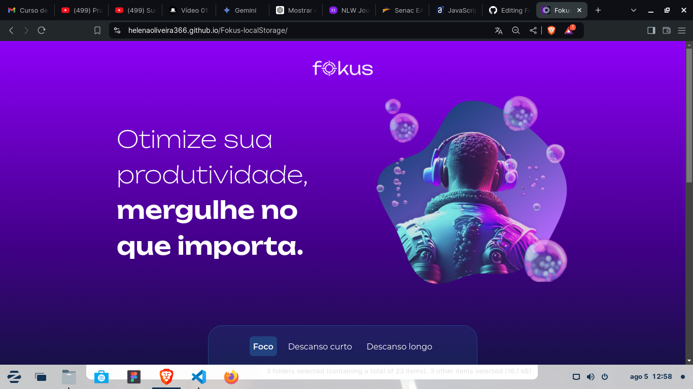
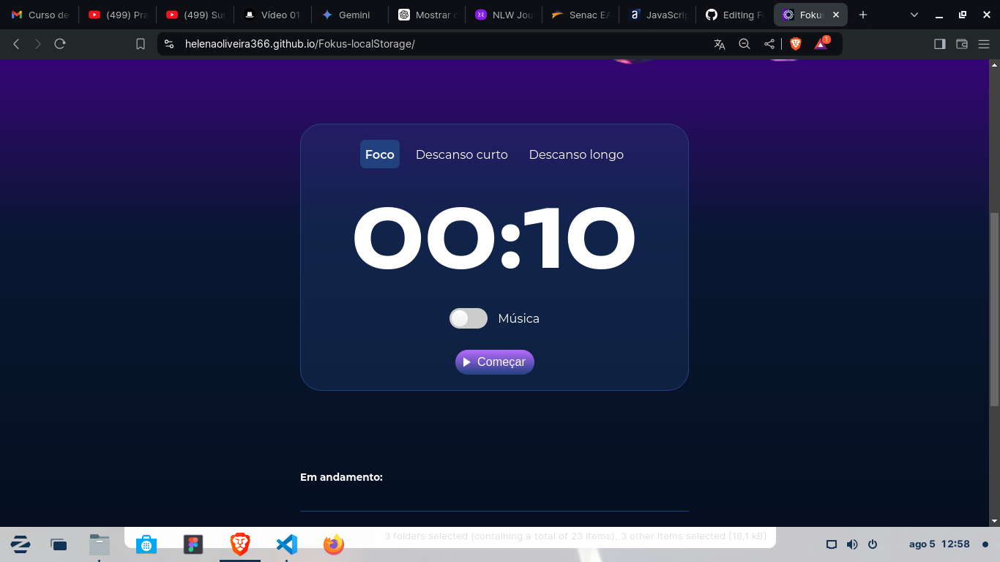
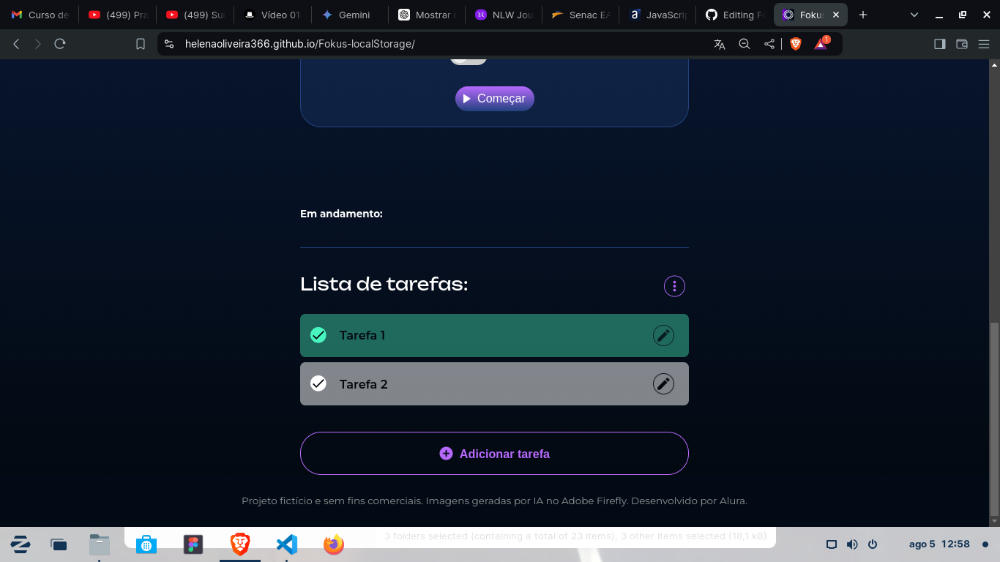

# Fokus com gerenciador de tarefas
Acesse: https://helenaoliveira366.github.io/Fokus-localStorage/

Projeto construído no cruso JavaScript: explorando a manipulação de elementos e da localStorage da Alura

Aplicação de pomodoro integrada a um básico gerenciador de tarefas <3

Conceitos aplicados:
+ Utilização de seletores CSS para interagir com elementos HTML através do JavaScript
+ Manipulação do DOM
+ Gerenciamento de eventos do usuário, como cliques ou envios de formulário
+ Utilização do armazenamento local persistente (localStorage) e manipulação de array
+ Lógica de programação

